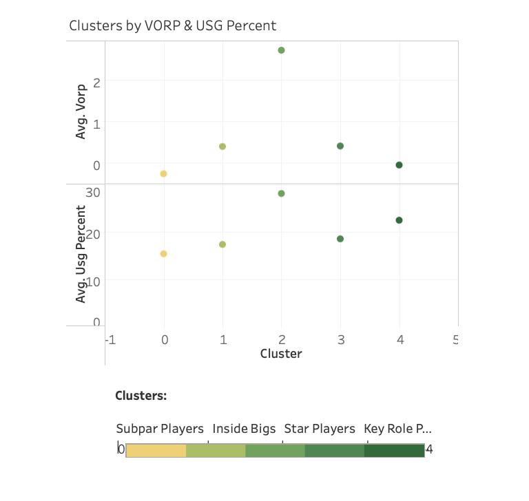

# NBA Player Analysis

### Overview of Project

## Background 
** check out our [google slides](https://docs.google.com/presentation/d/15AfPDk4v5dHxUoYU41ij-PVReolKnboE7pnida1XuS4/edit?usp=sharing)**
[Presentation slides](https://docs.google.com/presentation/d/1k--9bCzQdklvmKAXiYanF6IuN4zNPRv---5SX25Sh8U/edit?usp=sharing).

### Reason topic was selected
The overall style of play has  changed drastically in the past few years and using player positions to understand the game is no longer relevant. We are using unsupervised Machine Learning to create a new and different approach of grouping players to better analyze player style and roles in the team.

### Description of the source of data
Data was scraped from https://www.basketball-reference.com/
The first data set comprises of traditional NBA statistics.
The second data set comprises the advanced NBA statistics.

### Questions the team hopes to answer with the data
- Can our model help build and manage NBA roster?
- Who are the characteristic players in each cluster?
- How is the distribution of clusters in each NBA team?

### Description of the data exploration phase of the project
We are using player data from the 2020–21 NBA Regular season and are combining two data-sets from Basketball-reference. The first data-set from Basketball-reference comprises of traditional NBA statistics. We are looking at player statistics normalized to 36 minutes of game-time as opposed to looking at per-game averages because normalizing by minutes-per-game gives us a fairer representation of each player’s contributions. The second Basketball-reference data-set we are using comprises of “Advanced” statistics from the same group of players over the season. We are working with 540 NBA player data with 43 different stats.

### Description of the analysis phase of the project
Given our findings, we grouped our data into 5 clusters using k-means clustering and we analyzed the results. We were able to name and define the 5 clustered NBA groups and their characteristic players based on the stats we have. 

Group 0: Subpar Players 

Group 1: Inside Bigs 

Group 2: Star Players 

Group 3: Key Role Players

Group 4: G League Players
 

### Technologies, languages, tools, and algorithms used throughout the project
- SQL Alchemy
- Python
- Pandas
- Beautiful Soup
- SkLearn library
- Jupyter 
- Tableau

## Database
We've create a Postgres database and loaded it into AWS. We've initally created the database with two tables: NBA_stats and Advanced. We plan to create another table in postgres and using selected columns from both tables.
#### ERD:

#### Third Table integration:

#### Data Source: 
We utilized NBA player statistics from basketball-reference.com. We collected the data for the 2020-2021 season.
#### Cleaning/Formatting Data: 
We created a jupyter notebook file, used Beautiful Soup to scrape the data off of the [website](https://basketball-reference.com) and converted it into a Data frame. From this point, we used pandas to fill in NaNs and reformat columns names. We then exported the cleaned dataframes into CSVs.
#### Database Storage: 
We created another jupyter notebook to take the clean CSV files and import them into a Postgres SQL database using SQL Alchemy and Python. We also created a schema file to create two tables for our Analysis using SQL.

## Machine Learning
[ML README](https://github.com/irameowlee/player_analysis/blob/main/README_ML.md)

We created a python jupyter notebook file to conduct our machine learning models. We used SkLearn library to perform our unsupervised learning model define player roles and overall performance.
Description of Preliminary Data Preprocessing

#### What knowledge do we hope to glean from running an unsupervised learning model on this dataset? 
: clustering NBA players according to regular stats and advanced stats to find ways to better analyze basketball data.

#### What data is available? 
- NBA stats and advanced stats csv file
 Index(['player_id', 'Player', 'pos', 'age', 'tm', 'g', 'gs', 'mp', 'fg', 'fga', 'fg_percent', 'threepoint', 'threepoint_att', 'threepoint_percent', 'twopoint', 'twopoint_att', 'twopoint_percent', 'ft', 'fta', 'ft_percent', 'orb', 'drb', 'trb', 'ast', 'stl', 'blk', 'tov', 'pf', 'pts', 'per', 'ts_percent', 'threepoint_attr', 'ftr', 'orb_percent', 'drb_percent', 'trb_percent', 'ast_percent', 'stl_percent', 'blk_percent', 'tov_percent', 'usg_percent', 'ows', 'dws', 'ws', 'ws_per_48', 'obpm', 'dbpm', 'bpm', 'vorp']
- dropped player id, Player, pos, age and tm columns for machine learning. Dropped null values and made sure there were no duplicates.

##### Column Acronyms:
* pos = position
* tm = team
* g = total games
* gs = games started
* mp = Minutes Played
* fg = Field Goal
* fga = Field Goals attempted
* threepoint = 3-points made
* threepoint_att = 3-points attempted
* threepoint_percent = 3-point percentage
* twopoint = 2-points made
* twopoint_att = 2-points attempted
* twopoint_percent = 2-point percentage
* orb = Offensive Rebounds
* drb = Defensive Rebounds
* trb = Total Rebounds
* ast = Assists
* stl = Steals
* blk = Blocks
* tov = Turnovers
* pf = Personal Fouls
* pts = Total Points
* per = Player Efficiency Rating
* ts_percent = true shooting percentage
* threepoint_attr = 3-point attempt rating    
* ftr free throw rating
* orb_percent = Offensive rebound percentage
* drb_percent = Defensive rebound percentage
* trb_percent = Total rebound percentage
* ast_percent = Assist percentage    
* stl_percent = Steal percentage
* blk_percent = Block percentage
* tov_percent = Turnover percentage
* usg_percent = Usuage percentage          
* ows = Offensive win shares
* dws = Defensive win shares
* ws = Total win shares    
* ws_per_48 = Wins shares per 48 minutes         
* obpm = Offensive Box Plus/Minus
* dbpm = Defensive Box Plus/Minus    
* bpm = Total Box Plus/Minus    
* vorp = Value over replacement player

### Explanation of model choice, including limitations and benefits

- Scaled data with standardscaler
- Dimensionality reduction. Used PCA to reduce the number of dimensions and transformed larged set of variables into smaller ones.
- created elbow curve with the generated PCA. 

- Used the principal components data with the K-means algorithm with a K value of 5.
- created a scatter plot with the 2 prinicipal components. 

## Data Visualization
Tableau link: https://public.tableau.com/views/NBAPlayerAnalysis20-21/Analysis?:language=en-US&publish=yes&:display_count=n&:origin=viz_share_link
Visuals we will be showing include:
- Kmeans Cluster 
- Pie chart of teams with cluster grouping
- Circle Charts of impact of clusters on advanced stats
- Bar graphs of Wins Shares by cluster and team players

### Snapshot of our Visuals:
- Tableau cluster with NBA player grouping data

- Tableau pie chart with team roster analysis

- Tableau bar graph with NBA teams with grouping data

- Tableau bar chart of cluster impact on Win Shares

- Tableu circle charts on on VORP & USG percentage
- 
